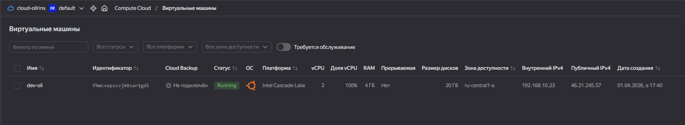
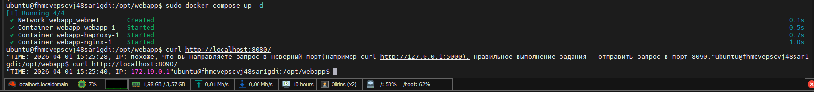
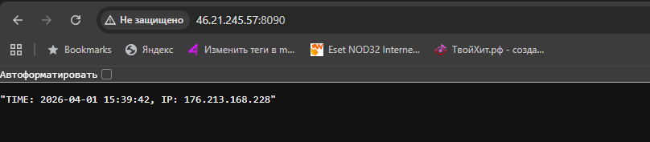

### Итоговый проект модуля «Облачная инфраструктура. Terraform»
 <br>
 <p lign="center">
FastAPI-приложение
  </p>
<br>
<p align="center">
  
  <br>
  <em> Скриншот облака яндкес с адресом </em>
</p>
<p align="center">
  
  <br>
  <em> Скриншот консоли вм с приложением</em>
</p>
<p align="center">
  
  <br>
  <em> Скриншот из браузера </em>
</p>
<br>
[Исходный код](https://github.com/Ollrins/Terraform-the-end/tree/main/src "Ссылка на GitHub")

<br><br><br><br><br>

### После apply

####  Получить registry ID и host ID (на локальном компьютере)
```bash
REGISTRY_ID=$(terraform output -raw registry_id)
DB_HOST=$(terraform output -raw db_host)
echo "Registry ID: $REGISTRY_ID"
echo "DB_HOST: $DB_HOST"
```
#### Сборка образа и загрузка в Container Registry
```bash
docker build -t cr.yandex/${REGISTRY_ID}/dev-oll:latest .
docker push cr.yandex/${REGISTRY_ID}/dev-oll:latest
```
### Перейти на машину

#### Создана директория
```bash
sudo mkdir -p /opt/webapp
```

#### Создан .env файл с параметрами подключения к Managed MySQL
```bash
sudo tee /opt/webapp/.env << 'EOF'
DB_HOST=rc1a-hcmuktjkjsv1llcn.mdb.yandexcloud.net
DB_PORT=3306
DB_USER=app
DB_PASSWORD=DevToOll!
DB_NAME=devoll
EOF
```

#### Добавление nginx и haproxy (reverse proxy)
#### Создан конфиг haproxy
```bash

sudo tee /opt/webapp/haproxy.cfg << 'EOF'
global
  maxconn 1000

defaults
  mode http
  timeout connect 5000ms
  timeout client 50000ms
  timeout server 50000ms

frontend http_front
  bind *:8080
  default_backend http_back

backend http_back
  balance roundrobin
  server web webapp:5000 check
EOF
```

#### Создан конфиг nginx
```bash
sudo tee /opt/webapp/default.conf << 'EOF'
server {
    listen 8090;
    server_name _;
    location / {
        proxy_pass http://haproxy:8080;
        proxy_set_header Host $host;
        proxy_set_header X-Real-IP $remote_addr;
        proxy_set_header X-Forwarded-For $remote_addr;
        proxy_set_header X-Forwarded-Proto $http_x_forwarded_proto;
    }
}
EOF
```
#### Создан сновной конфиг nginx
```bash
sudo tee /opt/webapp/nginx.conf << 'EOF'
user  nginx;
worker_processes  auto;

error_log  /var/log/nginx/error.log notice;
pid        /var/run/nginx.pid;

events {
    worker_connections  1024;
}

http {
    default_type  application/octet-stream;
    log_format  main  '$remote_addr - $remote_user [$time_local] "$request" '
                      '$status $body_bytes_sent "$http_referer" '
                      '"$http_user_agent" "$http_x_forwarded_for"';

    log_format proxied '$http_x_real_ip - $remote_user [$time_local] '
                        '"$request" $status $bytes_sent '
                        '"$http_referer" "$http_user_agent" "$proxy_add_x_forwarded_for";';

    access_log  /var/log/nginx/access.log  main;
    sendfile        on;
    keepalive_timeout  65;
    include /etc/nginx/conf.d/*.conf;
}
EOF
```

#### Создан compose.yml с тремя сервисами
```bash
sudo tee /opt/webapp/compose.yml << EOF
services:
  webapp:
    image: cr.yandex/${REGISTRY_ID}/dev-oll:latest
    ports:
      - "5000:5000"
    env_file:
      - .env
    restart: always
    networks:
      - webnet

  haproxy:
    image: haproxy:2.4
    ports:
      - "8080:8080"
    volumes:
      - ./haproxy.cfg:/usr/local/etc/haproxy/haproxy.cfg:ro
    depends_on:
      - webapp
    networks:
      - webnet

  nginx:
    image: nginx:latest
    ports:
      - "8090:8090"
    volumes:
      - ./nginx.conf:/etc/nginx/nginx.conf:ro
      - ./default.conf:/etc/nginx/conf.d/default.conf:ro
    depends_on:
      - haproxy
    networks:
      - webnet

networks:
  webnet:
    driver: bridge
EOF
```

#### Скрипт деплоя
```bash
sudo tee /opt/webapp/deploy.sh << 'EOF'
#!/bin/bash
cd /opt/webapp
docker compose pull
docker compose up -d
EOF
sudo chmod +x /opt/webapp/deploy.sh
```
